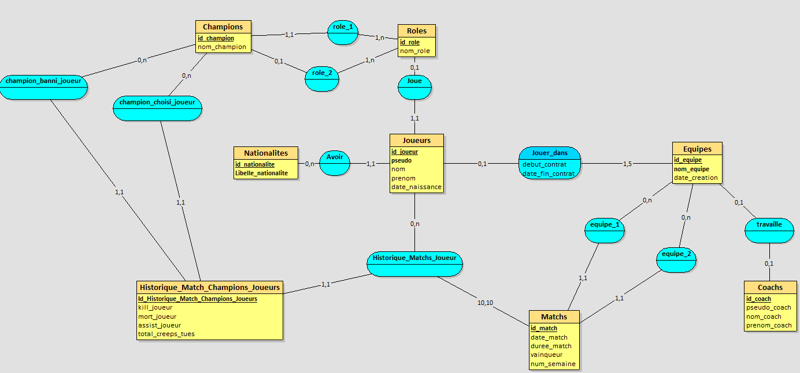
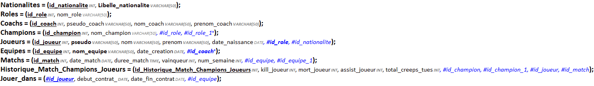

# **Base de donnée LFL 🗄**

> Auteur : Anthony ELUECQUE, Benjamin FOURNIER, Frédéric DOURNEL

# **Sommaire 📃**

- **1 Introduction**
    - 1.1 Le thème choisi
        - 1.1.1 Pourquoi ce sujet
        - 1.1.2 L'origine des données
        - 1.1.3 Notre base de données en chiffres 
        - 1.1.4 Documentation à propos de ce sujet
    - 1.2 Travail en groupe 
- **2 La base de données**
    - 2.1 Structure du projet
        - 2.1.1 Le MCD
        - 2.1.2 Le MLD
    - 2.2 La mise en pratique
        - 2.2.1 Création des tables
        - 2.2.2 Ajouts & Organisation des tuples
        - 2.2.3 La méthodologie
    - 2.3 La création des fonctions
        - 2.3.1 Les fonctions utilitaires pour L'utilisation de la BDD
        - 2.3.2 La gestion automatique du classement
- **3 Le site web associé à la BDD**
    - 3.1 Les outils
        - 3.1.1 Vue JS | Frontend
        - 3.1.2 Node JS | Backend
- **4 Conclusion**
    - 4.1 Les limites du projet
    - 4.2 Conclusion
- **5 Mode d'emploi**
    - 5.1 Comment consulter la BDD
    - 5.2 Comment consulter le site web associé à la BDD
    - 5.3 Les différentes routes de l’API

## **1 Introduction 📌**

Lors de notre 3ème Semestre de BUT, nous avions eu pour mission la réalisation d’une base de données sur un championnat par équipe ou individuel avec un classement automatique.   
Pour cela, Monsieur CAPITAINE nous a demandé l’utilisation de fonctions trigger sur le langage plpgsql.  
Cette SAÉ nous a permis de valider plusieurs apprentissages critiques : 
- Concevoir , gérer , administrer et exploiter les données de l'entreprise et mettre à disposition toutes les informations pour un bon pilotage de l’entreprise
- Développer (c’est-à-dire concevoir, coder, test et intégrer) une solution informatique pour un client

### **1.1 Le thème choisi**

> #### 1.1.1 Pourquoi ce sujet

Nous avons choisi comme sujet le championnat de la ligue Française de League Of Legends (LFL).   
Étant des joueurs de ce jeu, ils nous semblaient intéressant de créer une base de donnée sur celui-ci , afin de mettre en application nos connaissances en SQL sur un sujet qui parlait à tout le groupe.

> #### 1.1.2 L'oreigine des données

Bien qu’il existe des bases de données déjà complètes sur ce championnat, nous n’avions pas les droits sur celle-ci, nous avons donc dû partir de 0 et réfléchir à une solution efficace pour répondre à la problématique posée.  
A travers les différents sites faisant référence à ce championnat, nous avons récupéré des informations, statistiques, …, tout ce qui semblait être exploitable.  
Cependant, se basant sur un jeu et voulant refléter parfaitement les matchs qui se sont réellement déroulés et toutes les mécaniques du jeu, nous vérifions chaque donnée pour s’en assurer.  
Nous avons notamment utilisé notre connaissance sur le jeu pour pouvoir apporter, compléter les informations trouvées sur les différents sites internet.

> #### 1.1.3 Notre base de données en chiffres 

<table>
    <thead>
        <tr>
    </thead>
    <tbody>
        <tr>
            <td>Joueurs<br>
            <td>50</td>
        </tr>
        <tr>
            <td>Equipes<br>
            <td>10</td>
        </tr>
        <tr>
            <td>Champions<br>
            <td>163</td>
        </tr>
        <tr>
            <td>Matchs
            <td>90</td>
        </tr>
        </tbody>
</table>

> #### 1.1.4 Documentation à propos de ce sujet 

Pour comprendre comment se déroule le championnat de la LFL nous avons rédigé une documentation "explicationLFL" pour avoir plus de connaissances concernant le championnat que nous avons choisi.   
Ce document donne des informations sur le nom des équipes, des joueurs et des coachs mais aussi sur le déroulement du championnat pour élire l'équipe championne de France.  
Par ailleurs,  nous avons aussi rédigé une documentation "explicationLoL" qui explique le déroulement d'un match de League Of Legends. Ce document donne des explications sur les champions et leurs spécificités, les rôles jouables, la génération d'or et d'expérience.  
Ces 2 documents sont complémentaires mais permettent de comprendre plus en détail notre sujet.

### **1.2 Travail en groupe**

Afin de mettre en application ce que nous venons de voir en gestion de projet et l’élément moteur d’un groupe,    c'est-à-dire la communication, nous avons organisé les travaux pour que chaque membre du groupe ait un tâche à effectuer.  
Pour que chacun puisse accéder en temps réel au script de la base de données et voir les modifications de chacun, plusieurs outils existent comme Le Live Share de Visual Studio Code, il s'agit d'une extension qui permet de travailler en même temps sur un même fichier à la manière d'un Google Doc.  
Afin d’améliorer la communication du groupe en utilisant les outils mis à nos dispositions, Discord nous a semblé opportun pour échanger sur le projet.  
Cependant, l’usage de Github nous a semblé indispensable afin de garder un historique de nos versions.


## **2 La base de données 📦**

### **2.1 Structure du projet**

> #### 2.1.1 Le MCD

Afin de mieux visualiser la structure de la base de donnée. Nous avons modélisé un **Modèle Conceptuel de données**.  
A partir de nos recherches et de nos connaissances, nous avons construit ce MCD afin qu’il soit évolutif , il serait possible de revenir dessus, et d’ajouter de nouvelles tables sans modifier celles-existantes. Ce principe fait référence aux principes SOLID , ou la modification de l’existant n’est pas nécessaire à l’ajout.  
Cette conceptualisation et la construction des liens a été réalisée en groupe avant l’insertion des tuples, afin de s’assurer que sa structure soit optimale.  
Un avis à notre professeur référent, Monsieur CAPITAINE a notamment été demandé, et nous avons apporté des modifications par rapport aux remarques

Nous avons utilisé le logiciel Looping prévu pour cela :  https://www.looping-mcd.fr/

```
𝙇é𝙜𝙚𝙣𝙙𝙚 :

𝙟𝙖𝙪𝙣𝙚 : Tables de la base de données
𝙗𝙡𝙚𝙪 : associations entre les tables
𝙡𝙞𝙚𝙣 : définit le type d'association entre les tables
```

**Le MCD (Modèle conceptuel de données)**



> #### 2.1.2 Le MLD

Une fonctionnalité du logiciel Looping nous permet à partir d’un MCD de créer automatiquement par rapport à nous ajouts un **MLD**.  
Par cet outil, nous pouvons voir le contenu de la table avec la mise en évidence des clés primaires (en gras et souligné) et étrangères (en gras avec une couleur bleu et soulignées).

**MLD**


### **2.2 La mise en pratique**

> #### 2.2.1 Création des tables

Notre MLD nous a permis d’ajouter facilement les tables dans notre script SQL , puisque celui-ci permet de connaître chaque attributs de table, ainsi que les clés primaires et étranges.  
En prévention d’un classement automatique, nous avons en parallèle de cette création commencer à réfléchir sur les fonctions et les triggers associés.  
En effet, nos triggers permettant des vérifications avant et après ajout de tuple sur certaines tables, il était important de coordonnées ses 2 tâches.


> #### 2.2.2 Ajout & organisation des tuples

Comme dit auparavant , les BDD ne nous étaient pas accessibles.  
Nous avons inséré tous les tuples de notre base de données à la main (environ plus de 1200 insertions) . Cela nous a pris beaucoup de temps, si bien que les créneaux réservés à cette SAE ont été dépassé (plus de 15 heures d’insertions de tuples au lieu des 7H30 pour toute la SAE)  
Pour cela une méthodologie (sur laquelle nous nous attarderons juste après) a dû être mise en place. 


> #### 2.2.3 La méthodologie

Une méthode très stricte qui nous a permis de ne pas se perdre dans toutes ces données mais surtout pour ne pas faire d'erreur dans l'entrée de ces informations est l’utilisation de postman.  
Cette méthodologie a été appliquée plus particulièrement sur la table Historiques_matchs , ou un seul match possède 10 tuples (5 par équipes et donc 1 par joueur) sur les statistiques exploitable de celui-ci.  
Les autres membres du groupe ont notamment vérifié tuple après tuple pour s’assurer de la concordance entre les ajouts et l’existant.  
Cette stratégie nous a permis de rentrer les tuples sans perdre de temps, et pouvoir passer à la partie du classement automatique.


### **2.3 La création des fonctions**

Nous avons pour optimiser cette base de données et la rendre automatique, créer plusieurs fonctions.   
Pour répondre à la problématique posée, la création de triggers permettant la gestion automatique du classement a été une grande partie de notre projet.  
Cette gestion automatique nécessite des fonctions intermédiaires permettant d’exploiter plus facilement la base de données (GETTER, Calcul automatique, …)  
Pour notre championnat, nous avons décidé de créer plusieurs classements puisque celui-ci se déroule sur plusieurs semaines. Nous avons donc décidé de créer un classement
par semaine, mais aussi sur la totalité du championnat (SPLIT)  
Un trigger nous a semblé opportun sur les statistiques de chaque équipe du championnat après chaque ajout de match.

> #### 2.3.1 Les fonctions utilitaires pour l'utilisation de la BDD

`- getNomChampion(id_champion integer) ▶️ varchar`   
Permet de trouver le nom d'un champion à partie de son id 

`- AfficherChampionsBanMatch(id_match integer) ▶️ void`  
Permet d'afficher les 10 champions banni d'un match avec l'id du match

`- AfficherChampionsChoisiMatch(id_match integer) ▶️ void`  
Permet d'afficher les 10 champions choisi d'un match avec l'id du match

`- nbFoisChampBan(nom_champion varchar) ▶️ integer`  
Permet de trouver le nombre de fois qu'un champion a été banni à partir du nom de ce champion

`- rateBanChamp(id_champion integer) ▶️ real`
Permet d'obtenir le pourcentage que le champion a été banni sur tous les matchs déjà joués à partir de l'id de ce champion

`- nbFoisChampPick(nom_champion varchar) ▶️ integer`  
Permet de trouver le nombre de fois qu'un champion a été choisi à partir du nom de ce champion 

`- calcul_winrate_champion(nom_champion varchar) ▶️ decimal`  
Permet d'obtenir le taux de match gagné par champion à partir du nom de ce champion

`- calcul_winrate_equipe(id_equipe integer) ▶️ decimal`  
Permet d'obtenir le taux de match gagné par équipe à partir de l'id de cette équipe

`- calcul_kda_equipe(id_equipe integer) ▶️ decimal`  
Permet d'obtenir le kda par équipe à partir de l'id de cette équipe

`- calcul_kda_joueur(id_joueur integer) ▶️ decimal`  
Permet d'obtenir le kda par joueur à partir de l'id de ce joueur
 
> #### 2.3.2 La gestion automatique du classement

## **3 Le site web associé à la BDD 🌐**

Bien que cette partie n’était pas obligatoire, il nous semblait essentiel que cette base de données soit utilisée pour un site web pour plusieurs raisons.
La première était d’apprendre à utiliser nos connaissances dans divers domaines et de les combiner en un seul projet : une application Web reprenant notre SAE Actuel : une base de données.
La seconde pour le seul membre du groupe en parcours développement et Application, ELUECQUE Anthony de réaliser un projet de fond lors des entretiens de Stage.

Ce site web pour communiquer avec une base de données se compose en 2 parties : le backend et frontend.

Le Frontend est la partie que l’utilisateur du site voit , c’est le design, les boutons, …
Le backend est la communication entre la base de données et le site web.

Il permet de lier cette base de données à une API et de pouvoir, à partir du site web, envoyer des requêtes HTTP vers l’API.
Cette interface de programmation d’application est constamment mise à jour par rapport à notre base de données sur postgresql.

L’intérêt de cette application web dans ce projet était à partir de notre base de donnée de pouvoir interagir avec celle-ci en étant un simple utilisateur et non un développeur postgresql sur ubuntu.
Pour cela, il est évident qu’une application web soit plus explicite qu’un terminal noir et blanc.

Répositorie du site Web : https://github.com/Antorakk/lfl-app

### **3.1 Les outils**

> #### 3.1.1 Vue JS | Frontend

Doc : https://vuejs.org/guide/introduction.html

> #### 3.1.2 Node JS | Backend

Doc : https://nodejs.org/docs/latest-v17.x/api/  
Framework express : https://expressjs.com/

## **4 Conclusion 📌**

### **4.1 Les limites du projet**

Il y a eu quelques problèmes à la réalisation de ce projet comme, une restriction au niveau du temps qui était infime comparé au projet qui était à réaliser, ce projet devait être réalisé en même temps que certain autre projet, il allait donc jongler entre plusieurs projets.    
Puis pour notre base de données nous avons rempli à la main plus de 2000 tuples ce qui nous a pris un temps considérable et ce qui nous a ralenti à la finalisation de ce projet.

### **4.2 Conclusion**

A la fin de ce projet, nous avons réussi à réaliser un classement automatique fonctionnel de la LFL lors du Summer Split 2022. Ce classement, où une page web est associée à notre base de données, permet d'ajouter des équipes, des joueurs, des matchs et permet aussi de les supprimer. Nous avons aussi écrit des documents explicatifs concernant le jeu League Of Legends en lui même puis, un autre sur le fonctionnement du championnat de la LFL, ces documents permettent de comprendre facilement même pour un débutant.   
Ce projet qui s'est effectué en groupe, à permis une amélioration de la communication au sein d'un groupe informatique, ce qui est une compétence indispensable pour les années suivantes.  
Pour conclure que ce projet a été réalisé, malgré les problèmes rencontrés, en utilisant une bonne communication au sein du groupe et une bonne répartition des travaux en fonction des compétences de chacun.

## **5 Mode d'emploi 📜**

### **5.1 Comment Consulter la BDD**

Vous pouvez consulter la base de données en utilisant le site web, ou bien passer par un terminal ubuntu (version 20+) avec postgres.
	Nous recommandons de passer par notre vidéo, qui explique en détail comment la consulter.

### **5.2 Comment consulter le site web associé à la BDD**

*Nous vous recommandons de suivre la vidéo, nous ne détaillerons pas les étapes ici mais les grandes lignes.*

- Lancer sur deux fenêtres visuals studio codes les fichiers backend et frontend du site web.
- Dans le fichier backend, taper dans un terminal npm run dev
- Puis sur un navigateur, taper http://localhost:3000/ + la route de votre choix
- Dans le fichier frontend , taper dans un terminal npm run serve
- A nouveau dans un navigateur, taper http://localhost:8080 ou http://localhost:8081 (dépend des opérateurs) 

### **5.3 Les différentes routes de l’API**

<table>
    <thead>
        <tr>
    </thead>
    <tbody>
        <tr>
            <td>Routes  (Ajouter après http://localhost:3000/)<br>
            <td>Commandes SQL derrière cette route</td>
            <td>Explication de la commande SQL</td>
        </tr>
        <tr>
            <td>/matchs/<br>
            <td>SELECT * FROM Matchs;</td>
            <td>Liste de tous les matchs</td>
        </tr>
        <tr>
            <td>/matchs/:id_match<br>
            <td>SELECT * FROM Matchs WHERE id_match = :id_match;</td>
            <td>Information d’un match</td>
        </tr>
        <tr>
            <td>/champions</td>
            <td>SELECT * FROM Champions;</td>
            <td>Champions du jeu</td>
        </tr>
        <tr>
            <td>/equipes</td>
            <td>SELECT * FROM Equipes;</td>
            <td>Liste de toutes les équipes de la LFL</td>
        </tr>
        <tr>
            <td>/equipes/:id_equipe</td>
            <td>SELECT * FROM Equipes WHERE id_equipe = :id_equipe;</td>
            <td>Informations d’une seule équipe à partir de son identifiant</td>
        </tr>
        <tr>
            <td>/equipes/:id_equipe/kda</td>
            <td>SELECT * FROM calcul_kda_equipe(:id_equipe);</td>
            <td>KDA de l’équipe</td>
        </tr>
        <tr>
            <td>/equipes/:id_equipe/coach</td>
            <td>SELECT * FROM Coachs WHERE id_coach = (SELECT id_coach FROM Equipes WHERE id_equipe = :id_equipe);</td>
            <td>Coach de l’équipe</td>
        </tr>
        <tr>
            <td>/equipes/:id_equipe/stats</td>
            <td>SELECT * FROM Statistique_lfl WHERE id_equipe = :id_equipe;</td>
            <td>Statistiques des matchs d’une équipe à partir de son identifiant</td>
        </tr>
        </tbody>
</table>
