

    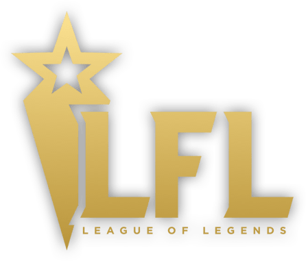

> Auteur : Eluecque Anthony, Fournier Benjamin, Dournel Frédéric

# **Sommaire 📃**

- 1 C'est quoi la LFL
- 2 Participants
- 3 Déroulement du championnat
- 4 Déroulement des Playoffs

## **1 C'est quoi la LFL ❓**

La  Ligue Française de League of Legends(LFL) est la principale ligue professionnelle de League of Legends en France produite par Webedia, en partenariat avec One Trick Production (OTP) et Riot Games France, dans laquelle s'affrontent les dix meilleures équipes françaises. La LFL a été lancée le 21 janvier 2019 dans la continuité du développement de la scène française sur League of Legends. 
Fort de son succès en France avec en moyenne près de 40 000 spectateurs sur l'année 2022, la Ligue Française de League of Legends a attiré des sponsors comme le CIC, Intel, Samsung, Aldi ou encore KitKat.

## **2 Participants** 🙋🏼

Durant la ligue d'été 2022, il a eu 10 équipes composées toutes de 5 joueurs et 1 coach.

<table>
    <thead>
        <tr>
            <th colspan="18">LFL Summer Slipt 2022
    </thead>
    <tbody>
        <tr>
        <td>Equipe / Rôles</td>
            <td>Toplaner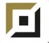</td>
            <td>Jungler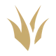</td>
            <td>Midlaner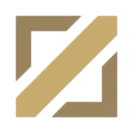</td>
            <td>AD Carry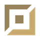</td>
            <td>Support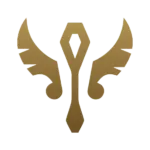</td>
            <td>Coach</td>
        </tr>
        <tr>
            <td>LDLC OL 
            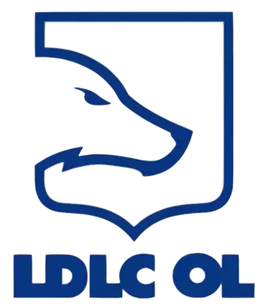</td>        
            <td>Ragner</td>
            <td>Yike</td>
            <td>Eika</td>
            <td>Exakick</td>
            <td>Doss</td>
            <td>Zeph</td>
        </tr>
        <tr>
            <td>BDS Academy 
            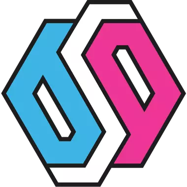</td>        
            <td>Adam</td>
            <td>Sheo</td>
            <td>Reeker</td>
            <td>Crownie</td>
            <td>Erdote</td>
            <td>GoToOne</td>
        </tr>
        <tr>
            <td>Karmine Corp 
            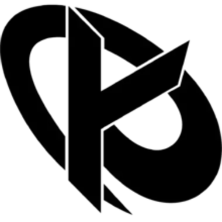</td>          
            <td>Cabochard</td>
            <td>113</td>
            <td>Saken</td>
            <td>Rekkles</td>
            <td>Hantera</td>
            <td>Striker</td>
        </tr>
        <tr>
            <td>Vitality.Bee 
            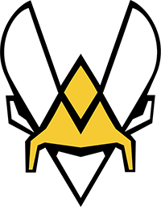</td>
            <td>Szygenda</td>
            <td>Skeanz</td>
            <td>Diplex</td>
            <td>Jeskla</td>
            <td>Jactroll</td>
            <td>Realistik</td>
        </tr>
        <tr>
            <td>Misfits Premier 
            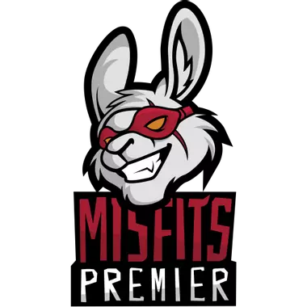</td>          
            <td>Kackos</td>
            <td>Shlatan</td>
            <td>Czajek</td>
            <td>Woolite</td>
            <td>Vander</td>
            <td>Delord</td>
        </tr>
        <tr>
            <td>Team Go 
            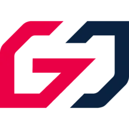</td>       
            <td>NuQ</td>
            <td>Karim KT</td>
            <td>Ronaldo</td>
            <td>Smiley</td>
            <td>Veignorem</td>
            <td>Jesiz</td>
        </tr>
        <tr>
            <td>Solary 
            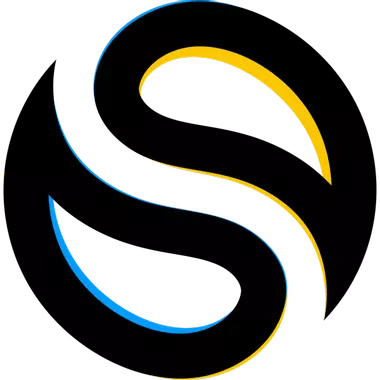</td>         
            <td>Kio</td>
            <td>Djoko</td>
            <td>Scarlet</td>
            <td>Asza</td>
            <td>Steeelback</td> 
            <td>Jon</td>
        </tr>
        <tr>
            <td>Gameward 
            </td>    
            <td>Melonik</td>
            <td>Akabane</td>
            <td>Czekolad</td>
            <td>Innaxe</td>
            <td>Kamilius</td>
            <td>Malau</td>
        </tr>
        <tr>
            <td>Mirage Elyandra 
            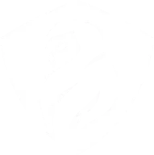</td>
            <td>Badlulu</td>
            <td>Memento</td>
            <td>RangJun</td>
            <td>CodySun</td>
            <td>Raxxo</td>
            <td>Hellombre</td>
        </tr>
        <tr>
            <td>Team Oplon 
            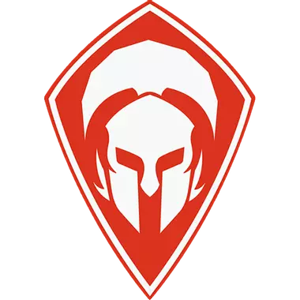</td>
            <td>Darlik</td>
            <td>Shernfire</td>
            <td>Peng</td>
            <td>Bung</td>
            <td>Twiitz</td>
            <td>Aries</td>
        </tr>
        </tbody>
</table>

## **3 Déroulement du championnat 🏆**

Durant le championnat chaque équipe se rencontre 2 fois le match aller pour le match retour ce qui fait un total de 18 matchs par équipe, le classement est réalisé en fonction des victoires de chaque équipe, dans la logique l'équipe qui le plus de victoire sera plus haut dans le classement et inversement. Si 2 équipes sont ex aequo sur le nombre de victoire, elles sont départagées par leur temps de victoire moyen, l'équipe qui a le plus court temps de victoire sera 

## **4 Déroulement des playoffs 🏅**

Lors des playoffs, qui se déroule après le championnat, les 6 premières équipes sont retenus et joue sous forme de tournoi. La troisième contre la cinquième et la quatrième contre la sixième équipe, les deux équipes gagnantes s'affrontent puis l'équipe gagnante affrontent l'équipe perdante dans le match de la première et deuxième équipe. L'équipe vainqueur passe directement en finale et l'équipe perdante affronte l'équipe comme décrit avant. L'équipe gagnante sera donc finaliste et logiquement, l'équipe gagnante est donc championne de France

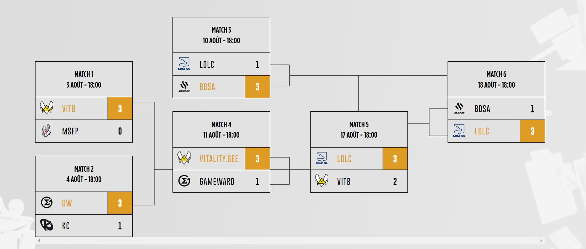

