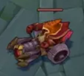

-- Auteur : Eluecque Anthony, Fournier Benjamin, Dournel Frédéric --

-- La Carte --

-- Gagner Une Partie --

Le but de chaque equipe est de briser le nexus adverse pour remportés la partie. Le nexus est defendu par des tours et des inibihteurs qui doivent être détruit avant de pouvoir casser le nexus. Les joueurs ont donc un rôle d'attaque et de défense, ils doivent à la fois détruire les tours et nexus ennemis mais aussi défendre leurs tours et leur nexus. 
La façon de gagner une partie se fait tout au long de la partie en prenant l'avantage sur l'or, sur l'expérience et sur les objectifs durant la partie mais aussi prendre un avantage durant la draft en prenant des champions qui sont plus forts que d'autres et donc d'adopter une stratégie même avant la partie.

-- Les Rôles --

Une partie contient 5 rôles distincts comme TopLaner (celui qui va jouer en haut de la carte), Jungler (celui qui va se balader sur la carte pour apporter de l'aide à ses alliés ou réaliser les objectifs), MidLaner (celui qui va jouer au milieu de la carte), AD Carry (celui qui va jouer en bas de la carte) et enfin Support (celui qui va accompagner l'AD Carry dans ses déplacements).
Il y a donc des champions favorables à aller sur certaines lanes.

-- Rôle : Toplaner --

Le Toplaner est le rôle où le joueur se trouve sur le haut de la carte

-- Rôle : Jungler --

Le jungler est le rôle va se déplacer sur toute la carte

-- Rôle : Midlaner --

Le Midlaner est le rôle où le joueur se trouve sur le milieu de la carte

-- Rôle : AD Carry --

L'AD Carry est le rôle où le joueur se trouve en bas de la carte

-- Rôle : Support --

Le Support est le rôle où le joueur va accompagner l'AD Carry dans ses déplacements et le supporter

-- Les Champions --

Pour jouer une partie de League Of Legends, il faut tout d'abord choisir un champion, donc chaque joueur choisi 1 champion durant la draft.
Les Champions ont tous un ou plusieurs rôles spécifiques, et sont choisi en fonction d'une stratégie et en fonction des forces et faiblesses de chaque champion

-- La Draft --

La Draft est un moment cruciale avant le match, car elle permet de choisir les champions qui vont être joués durant la partie et donc d'adopter une stratégie et de choisir des champions en fonction des champions ennemis déjà choisi. Mais aussi faire une stratégie car durant la Draft les 2 équipes peuvent bannir 5 champions qui ne pourront pas être jouer pendant la partie, ce qui fait 10 champions non-jouable

-- Les Objectifs neutre --

Les objectifs sont des atouts importants et apparaissent au fur et à mesure de la partie comme :

Les dragons qui donnent des bonus permanents à l'équipe lorsqu'ils sont tués par celle-ci, ils apparaissent toutes les 5 minutes et il en existe 7, infernal, nuage, océan, chimique, hextech, montagne, ancestral(qui apparait lorsque 4 dragons ont été tués) qui ont tous des bonus différents.

Ensuite le hérault de la faille, qui se trouve à l'opposé du dragon, et qui apparait la première fois à 8 minutes et une deuxième fois 6 minutes après qu'il soit tué. Le hérault de la faille ne peut apparaître après 20 minutes. L'équipe qui tue le hérault pourra pendant un court laps de temps détruire plus rapidement les batiments ennemi.

Enfin, à 20 minutes puis 6 minutes après être tués, le baron nashor apparaît au même endroit que le hérault de la faille, celui ci donne des bonus non-permanent à l'équipe qui le tue, ces bonus font effets pendant 3 minutes et permettent de détruire plus rapidement les batiments ennemi.

-- L'Or --

L'Or est une ressource fondamental dans League Of Legends car cette ressource permet d'acheter des objets, qui donnent des statistiques bonus aux champions sur lesquels les objets sont équipés. Les objets sont essentiels car ils permettent de prendre un avantage sur son adversaire. Donc pour prendre l'avantage, il faut plus d'or que l'adversaire. Comment gagner cet or ? Il y a plusieurs façons, la première est de tuer les sbires ennemis, ces sbires donnent un montant d'or différent en fonction de leur type (Guerrier, Mage ou Canon) 
Une autre source d'or, en tuant les champions ennemis et c'est à ce moment là qu'intervient le fait de combat entre chaque joueur pour prendre un avantage dans la partie.
La dernière source d'or et qui est exploité le plus par le jungler, sont les monstres dans la jungle, chaque camps donnent une centaine d'or

-- L'expérience --

L'expérience des champions dans la partie découle directement de l'or car en tuant des sbires, des champions, des monstres de la jungle de l'expérience est gagné. L'expérience permet d'augmenter le niveau de son champion avec un maximum de 18 et à chaque nouveau niveau, le champion gagne des statistiques (ces améliorations sont différentes entre tous les champions) et le joueur peut choisir une attaque, parmis les 4, du champions à améliorer.

